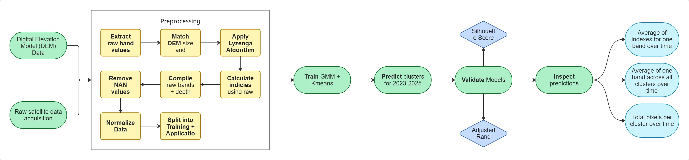
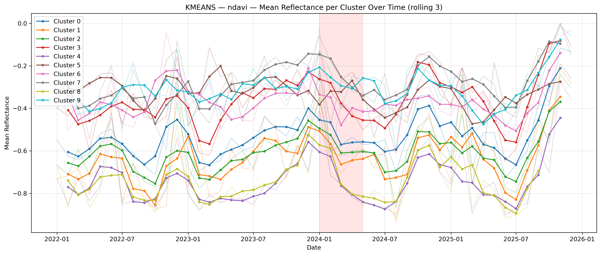
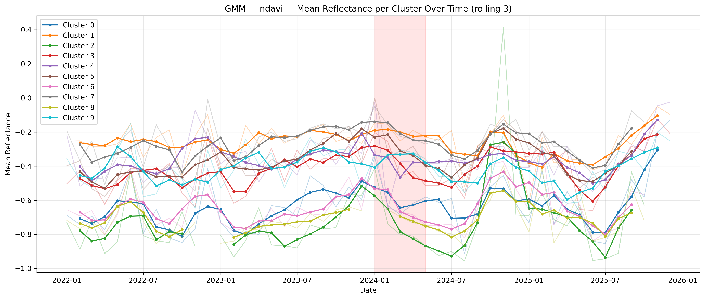
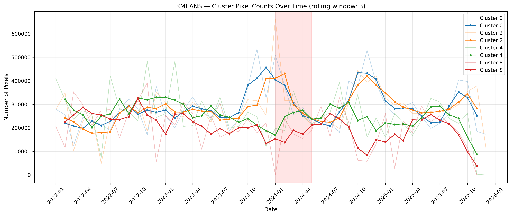
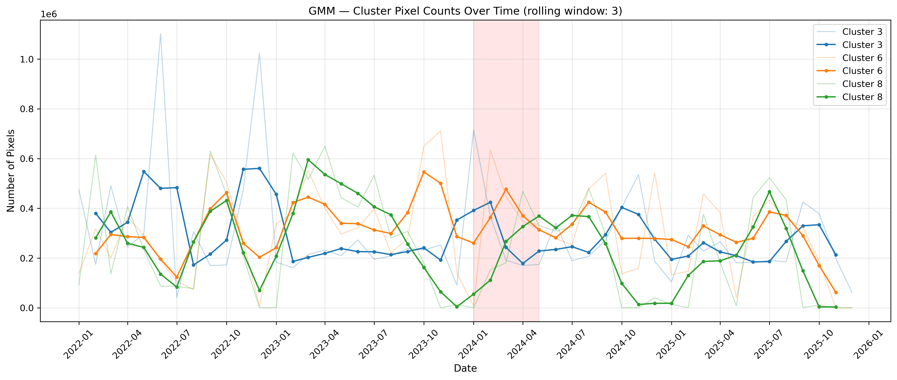

# RemoteSensing_CoralReefs

## Introduction

Measuring change in One Tree Island Reef from 2023 to 2025 following the extreme 2024 bleaching event using atmospheric remote sensing data. Three spectral indices are compared based on their ability to distinguish healthier reef areas from bleached reef areas using unsupervised machine learning techniques.

> NOTE: To run the full pipeline in models_notebook.ipynb, a device with a minimum of 16GB of RAM and a minimum of 45GB of local storage is required. 

## How to Use

### Notebooks
- [exploratory_notebook.ipynb](notebooks/exploratory_notebook.ipynb) - Experimental notebook with initial exploratory code.
- [models_notebook.ipynb](notebooks/models_notebook.ipynb) - Finalized notebook with the entire pipeline as visualized in the flowchart, excluding validation results. 
- [validation_results.ipynb](notebooks/validation_results.ipynb) - Notebook containing cluster validation results.

### Models
The models trained on the bands and indices can be found in [models/](models). Due to github's file size limits, only the GMM model could be uploaded. The K-Means model will need to be retrained (which may take between 20 - 60 minutes depending on the hardware of the device).

### Scripts 
- [cache.py](scripts/cache.py) - For saving and reloading intermediary files and models to avoid having to rerun time-consuming pipelines
- [config.py](scripts/config.py) - For grouping different (hyper)parameters in one location for improved oversight and efficient changing.
- [data_loading.py](scripts/data_loading.py) - Functions for the preprocessing pipeline including loading raw data, extracting raw bands, applying lyzenga algorithm, calculating indices, and returning a stacked array.
- [features.py](scripts/features.py) - For engineering and final preprocess features before modeling.
- [lyzenga.py](scripts/lyzenga.py) - For functions for the lyzenga algorithm pipeline.
- [model.py](scripts/model.py) - For training, predicting, and evaluating GMM and Kmeans models.
- [validation_GMM.py](scripts/validation_GMM.py) - For validating GMM clustering results.
- [validation_KMeans.py](scripts/validation_KMeans.py) - For validating GMM clustering results.
- [visualization.py](scripts/visualization.py) - For plotting, visualizing, and saving results.
- [extra/](scripts/extra)
  - [compiling_metadata.py](scripts/extra/compiling_metadata.py) - Script used to compile general metadata into one file.
  - [scenes_collection.py](scripts/extra/scenes_collection.py) - Script used to compile metadata about the PSScenes into one file.

### File Naming Scheme
The file names for the models and results contain the metadata about what type of run it was obtained from. The naming scheme follows the following structure:

1. `General Info` - Sometimes multiple parts e.g. `cluster_means`
2. `Rolling Average` - If rolling average used, else nothing.
3. `Model` - Either `gmm` or `kmeans` if results based on trained model, else nothing.
4. `Training Year(s)` - 'B' stands for 'Baseline Year(s)' e.g. `B(2022,2023)`
5. `Number of clusters`
6. `Temporal Aggregation` - Whether the data is aggregated by month (`MS`) or year (`YS`)
7. `Data Aggregation` - How the temporal data is aggregated (using `medain`, `mean`, `max`, `min`, etc.)
8. `Bathy` - Whether it has been corrected for depth using bathymetric data
9. `Number of features` - How many features the model was trained on.

Final result:

`file_name = <1>_<2>_<3>_<4>_<5>_<6>_<7>_<8>_<9>.ext`

Example:

`ndavi_RA_gmm_B(2022,2023)_k10_MS_median_bathy_11F.png`

## Data & Methods

### Data
For the full details on the data used in this research, please refer to [DATA_SOURCES.md](DATA_SOURCES.md). 

The raw satellite data is found in [data/raw/PSScene](data/raw/PSScene). Each file contains a suffix with the name of the researcher responsible for downloading that particular instance of the Area of Interest (AOI). Because multiple researchers have downloaded multiple instances of this AOI, we  also have multiple metadata files. These metadata files were compiled into one coherent file which you can find in [data/processed/metadata_merged](data/processed/metadata_merged).

The temporal boundaries are between January 2022 and December 2025 with each month containing on average two observations. 

Imagery was acquired by ‘SuperDove’ tool which were preprocessed according to PlanetScope-Ortho-Analytic-8B-SR, resulting in images that are orthorectified, and display scaled Surface Reflectance comparable to Landsat images (Moon et al., 2021; Planet.com, 2025). 

Extreme values were reduced using percentile clipping at the 2nd and 98th percentiles. As varying water depths influence the absorption of different wavelengths unevenly, the spectral bands of coastal blue, blue, and green were corrected for water depth using the Lyzenga algorithm (Lyzenga, 1978). For more details on the Lyzenga Algorithm, please refer to [lyzenga_alg_details.md](reports/Lyzenga_alg_details.md).

### Method

## Results & Reports
- The general results of this research can be found in [reports/figures](reports/figures). 
- The model validation results can be found in [data/processed/validation_results](data/processed/validation_results). 
- The final research report can be found at [reports/Coral-Reefs-Unusp-ML.pdf](reports/Coral-Reefs-Unusp-ML.pdf).
- A detailed explanation on how the Lyzenga Algorithm works can be found at [reports/Lyzenga_alg_details.md](reports/Lyzenga_alg_details.md)

### K-Means Monthly Predictions:

### Gausian Mixture Model Monthly Predictions:

### NDAVI Rolling Average

This shows the 3-month rolling average NDAVI values for all clusters across time. The red band represents the period in which the bleaching event took place.

### Total Pixels Per Cluster

Total count of pixels per cluster smoothed with a rolling window of 3 months. The K-Means figure shows clusters 0 & 2 which (subjectively) represent coral clusters, and cluster 4 & 8 represent sediment-type clusters. The GMM figure shows clusters 3 & 6 which represent coral clusters, and cluster 8 which represents sediment-type clusters. The red band highlights the recorded bleaching period of One Tree Island Reef.

